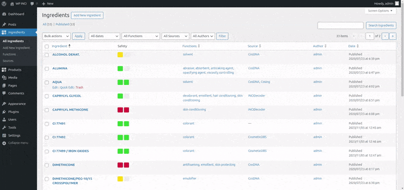
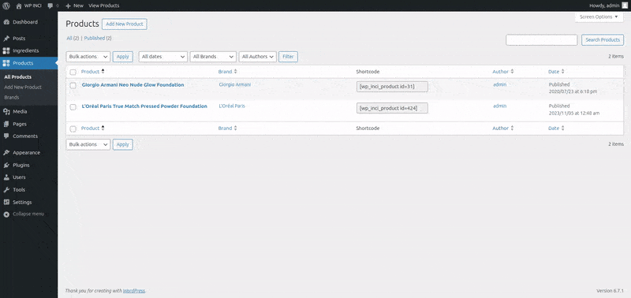
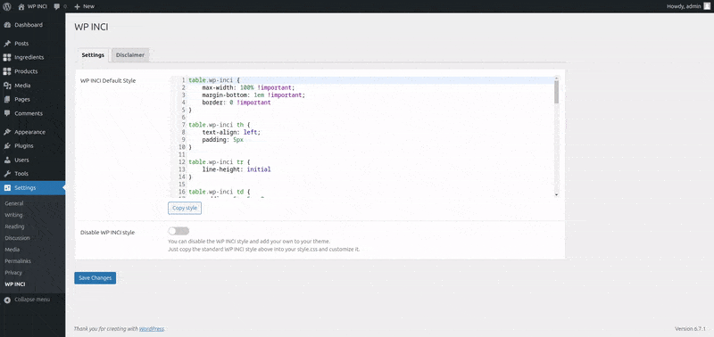
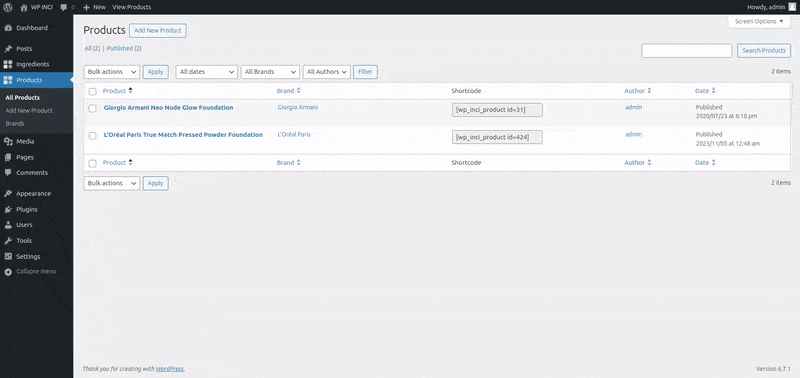
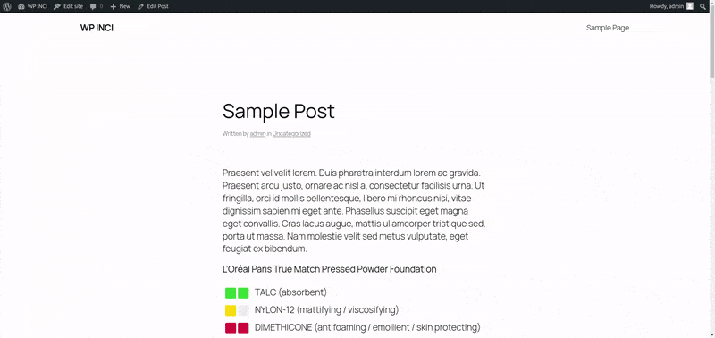

# 

 
  

.%22},%22plugins%22:[%22wp-inci%22],%22steps%22:[{%22step%22:%22importWxr%22,%22file%22:{%22resource%22:%22url%22,%22url%22:%22https://raw.githubusercontent.com/xlthlx/wp-inci/main/data/wpinci-products-sample.xml%22}}]})

**Contributors:** xlthlx \
**Donate link:** https://paypal.me/xlthlx \
**Tags:** INCI, ingredients, cosmetics, makeup \
**Requires at least:** 5.9 \
**Tested up to:** 6.8 \
**Stable tag:** 1.7.0 \
**Requires PHP:** 8.0 \
**License:** GPLv3 or later \
**License URI:** https://www.gnu.org/licenses/gpl-3.0.html

A WordPress plugin to manage INCI (International Nomenclature of Cosmetic Ingredients).

## Description

A WordPress plugin to manage INCI (International Nomenclature of Cosmetic Ingredients). You can set up your database of ingredients and products and easily insert a product table into posts and pages using a shortcode.
There are two example products with ingredients into the `data` directory that can be imported using the standard WordPress Importer.

### Plugin Features

* Custom Post Type Ingredient: it comes with a function list, a source list and a visual safety field.
* Custom Post Type Product: it comes with a brand taxonomy.
* Single and multiple search for ingredients: check the ingredient against the local database.
* Options: possibility to exclude the default CSS, copy it into your style.css and customize it; change the disclaimer content.
* Shortcode: in the product list, there is a column where you can copy the 'basic' shortcode relative to a specific product.
If you need a different way to display it, you can:

    1. specify a different title
  
    Example: [wp_inci_product id="33591" title="My custom title"]
    2. automatically insert the product permalink
  
    Example: [wp_inci_product id="33591" link="true"]
    3. remove the ingredients listing
  
    Example: [wp_inci_product id="33591" link="true" list="false"]
    4. remove the safety from ingredients listing
  
    Example: [wp_inci_product id="33591" safety="false"]

* Languages: English, Italian.

## Support

If you need support or have a feature request, please use the [support forum](https://wordpress.org/support/plugin/wp-inci/).

## Screenshots

### 1. Ingredients list and single ingredient

### 2. Product list and single product

### 3. How to manage options

### 4. How to use the product shortcode

### 5. Post example

## Changelog

### 1.7.0

* Tested up to 6.8
* Updated dependencies

### 1.6.9

* Updated screenshots
* Updated dependencies
* Better CSS
* Added blueprint.json

### 1.6.8

* Fixed dependencies

### 1.6.7

* Tested up to 6.7
* Updated dependencies

### 1.6.6

* Tested up to 6.6
* Updated dependencies

### 1.6.5

* Tested up to 6.5
* Updated dependencies

### 1.6.4

* Tested up to 6.4
* Updated dependencies
* Removed Product Gutenberg block
* Updated data xml

### 1.6.3

* Tested up to 6.3
* Bugfix
* Updated dependencies

### 1.6.2

* Tested up to 6.2
* Bugfix
* Updated dependencies

### 1.6.1

* Linted PHP
* Updated dependencies

### 1.6.0

* Tested up to 6.1
* Updated dependencies
* Added composer scripts
* Linted all code
* Removed Grunt
* Added npm scripts

### 1.5.2

* Tested up to 6.0
* Updated dependencies

### 1.5.1

* Updated translation
* Bugfix

### 1.5

* Tested up to 5.9
* Updated dependencies
* Added Product Gutenberg block

### 1.4

* Tested up to 5.8
* Updated dependencies

### 1.3

* Tested up to 5.7
* Updated dependencies
* Added numbers to multiple ingredients list

### 1.2.1

* Tested up to 5.6

### 1.2

* Hidden Welcome Tips popup and disabled fullscreen mode for Gutenberg (only for Products and Ingredients)
* Tested up to 5.5.3
* Bugfix

### 1.1.2

* Bugfix

### 1.1.1

* Changed admin icon
* Support for blocks

### 1.1.0

* New: ingredients multiple search

### 1.0.2

* Fixed CSS
* Added safety to ingredients list

### 1.0.1

* Tested up to 5.5
* Bugfix

### 1.0

* First release

## Upgrade Notice

### 1.6.4

* If you were using the Product Gutenberg block,
you should change every block into a shortcode before upgrading.

## Installation

1. Upload `wp-inci` folder to the `/wp-content/plugins/` directory
2. Activate the plugin through the 'Plugins' menu in WordPress
3. Enjoy

## Credits

* [CMB2](https://en-gb.wordpress.org/plugins/cmb2/) by [CMB2 team](https://cmb2.io/)
* [Extended CPTs](https://github.com/johnbillion/extended-cpts) by [John Blackbourn](https://johnblackbourn.com/)

## Frequently Asked Questions

### Can I translate the plugin interface?

Yes, just use the .POT file in the `languages` folder.
